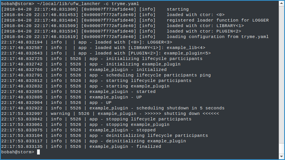

[](https://travis-ci.org/mrbald/ufw)

&mu;FW - Micro Framework
========================

&mu;FW is a minimalist framework for rapid server side applications prototyping and experimental work on [Unix-like][1] operating systems, primarily [Linux][2] and [macOS][3].
Those familiar with [Spring][4] or [Guice][5] may experience a strong deja-vu &mdash; dependency injection support was one of the &rarr;

Design Objectives
-----------------

* Minimum number of lines of code &mdash; clean concepts, compact implementations
* Modularity in spirit of [inversion of control][6]
* [Late binding][7] support via [shared library][11]-based [plugins][12]
* Consistency in module configuration, lifecycle, concurrency, and logging
* Singleton-free design with traceable dependencies
* Structured configuration reflecting both the application topology and the concurrency model
* Zero steady state runtime overhead
* Hacking-friendly design

Following the core C++ design principle, the rule _"you don't pay for what you don't use"_ is followed where possible.

Introduction
------------


### Terminology

The terminology used in the framework maps directly to the main building blocks, which are

* _entity_ - an identifiable building block of the application (a module)
* _application_ - container of _entities_
* _loader_ - an _entity_ capable of loading other _entities_
* _lifecycle_participant_ - an _entity_ with application managed lifecycle
* _execution context_ - set of rules for code execution (e.g. a specific thread, a thread pool, a strand on a thread pool, ...)
* _launcher_ - a binary (ufw_launcher, the entry point into an application)

### Configuration

Application configuration language is hierarchical [YAML][8].
This format gives a good representation of both application bootstrap process and the runtime structure.

### Lifecycle Phases

Application modules are created in the order they are defined in the configuration file and are destroyed in the reverse order.
Modules can opt to participate in the structural lifecycle by extending the virtual `ufw::lifecycle_participant` base.
The lifecycle phases `lifecycle_participant`-s are transitioned through are below.
The order of transition among individual participants matches their declaration order in the application configuration file.

* `init()` - *lifecycle_participants* may/should discover and cache strongly typed references to each other and fail fast if anything is missing or is of a wrong type
* `start()` - *lifecycle_participants* may/should establish required connections, spawn threads, etc.
* `up()` - *lifecycle_participants* may start messaging others
* `stop()` - opposite of `start()`
* `fini()` - opposite of `init()`

### Loaders

A subset of entities capable of loading other entities is called _loaders_.
A _loader_ _entity_ extends the virtual `ufw::loader` base.
_loaders_ are _entities_.
_loaders_ can load other _loaders_.
A special "seed" _loader_  &mdash; the `default_loader`, is used by the _application_ to load _entities_ by name (including other loaders).
Whether or not an _entity_ is loaded with a _loader_ is specified in the config (flexibility!).
_entities_ can be registered in the application programmatically without _loaders_.
The application registers the `default_loader` in directly in the constructor.
The default launcher registers `LIBRARY` (loads shared libaries) and `PLUGIN` (loads entities from shared libraries) loaders before initiating the application bootstrap.

### Concurrency

Application initialisation is done single-threaded in the application main thread.
Once the application is up the main thread becomes the host of the _default execution context_.
The _default execution context_ an instance of the `boost::asio::io_context` accessible from _entities_ via `this.context()`.
All other concurrency models are incremental to the `ufw.application`.

### Logging

Logging is a part of the framework. Modules have scoped tagged loggers (with help of macros and context-sensitive symbol lookup).
The Boost.Log library was taken as Boost is already on the dependency list and the subject library is flexible and reliable.
This logger is not the fastest around, but it's probably one of the cheapest to integrate with.

The logger is configured the same way as any other entity.
The _config_ part of the configuration is passed unchanged to the Boost.Log initializer.
See the configuration file fragment below as an example.

Trying It
---------

&mu;FW comes with an _example_ module packaged into a plugin shared library (`libexample.so` on [Linux][2]).

The below configuration fragment has a single instance of the _example_ module.

```
---
application:

  entities:
    # ====== logger ======
    - name: LOGGER
      config: |
        [Core]
        DisableLogging=false
        LogSeverity=error

        [Sinks.Console]
        Destination=Console
        Format="%TimeStamp(format=\"%H:%M:%S.%f\")% | %Severity(format=\"%6s\")% | %ThreadPID% | %Entity% - %Tag%%Message%"
        Asynchronous=true
        AutoFlush=true

    # ====== a dynamic library ======
    - name: example_lib
      loader_ref: LIBRARY
      config:
        filename: libexample.so

    # ====== an entity -- plugin from a dynamic library ======
    - name: example_plugin
      loader_ref: PLUGIN
      config:
        library_ref: example_lib
        constructor: example_ctor
...

```

To run it, store the above fragment into a YAML file (say config.yaml) and run the &mu;FW launcher as `ufw_launcher -c config.yaml`.

The console log should look similar to the below screenshot.



Building Dependencies
---------------------

The author's main development platforms are x86\_64 [Arch Linux][9] and [macOS + Homebrew][10].
Both have quite up to date versions of all _&mu;FW_ dependencies.
For those working in a less bleeding-edge enviroronments - below are the instructions for building the dependencies from scratch.

### Boost
Use instructions from the [Boost Home Page](https://boost.org)
The _&mu;FW_ is using these modules:
* system
* program_options
* log
* boost_unit_test_framework

### YamlCPP

```
$ git clone https://github.com/jbeder/yaml-cpp.git
$ mkdir yaml-cpp-build && cd yaml-cpp-build
$ cmake -DBUILD_SHARED_LIBS=ON -DCMAKE_BUILD_TYPE=Release ../yaml-cpp
$ make -j$(nproc) && sudo make install
```

### CapNProto (optional - examples)

```
$ git clone https://github.com/sandstorm-io/capnproto.git
$ mkdir capnproto-build && cd capnproto-build
$ cmake -DCMAKE_BUILD_TYPE=Release ../capnproto/c++
$ make -j$(nproc) && sudo make install
```

Building
--------

### Compiling

    $ git clone https://github.com/mrbald/ufw.git
    $ mkdir ufw-build && cd ufw-build
    $ cmake -DCMAKE_BUILD_TYPE=Release [-DCMAKE_INSTALL_PREFIX=$HOME/local] ../ufw
    $ make -j$(nproc)

### Running tests

To run all tests run

    $ make unit-test

To run individual tests with verbose output run

    $ make BOOST_TEST_LOG_LEVEL=all BOOST_TEST_RUN_FILTERS=ufw_app/* unit-test

### Running benchmarks

    $ make benchmark

### Installing

    $ sudo make install

Using
-----

TODO

Hacking
-------

TODO

References
----------
[CMake/How To Find Libraries](https://cmake.org/Wiki/CMake:How_To_Find_Libraries)
[Markdown Cheatsheet](https://github.com/adam-p/markdown-here/wiki/Markdown-Cheatsheet)
[Draw.io](https://www.draw.io)


[1]: https://en.wikipedia.org/wiki/Unix-like
[2]: https://en.wikipedia.org/wiki/Linux
[3]: https://en.wikipedia.org/wiki/MacOS
[4]: http://spring.io/
[5]: https://github.com/google/guice
[6]: https://en.wikipedia.org/wiki/Inversion_of_control
[7]: https://en.wikipedia.org/wiki/Late_binding
[8]: http://yaml.org/
[9]: https://www.archlinux.org/
[10]: https://brew.sh/
[11]: https://en.wikipedia.org/wiki/Library_(computing)
[12]: https://en.wikipedia.org/wiki/Plug-in_(computing)
